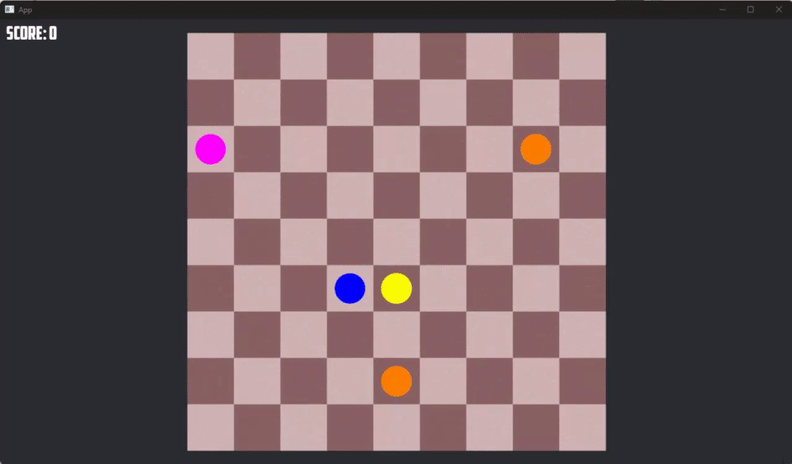

<div align="center">

# Lines

### Connect five or more same-colored balls in a line to score

[](https://www.rust-lang.org/)
[](https://bevyengine.org/)
[](https://doc.rust-lang.org/cargo/)
[](https://github.com/jackinf/lines)

</div>

## Overview

Lines (also known as Color Lines) is a classic puzzle game implemented in Rust on top of the [Bevy](https://bevyengine.org/) game engine. Balls of random colors appear on a 9x9 grid, and your goal is to move them around to form lines of five or more matching balls, which then clear from the board and earn points. The game uses an event-driven, entity-component-system (ECS) architecture, with `bevy_prototype_lyon` for vector rendering and `petgraph` for path validation when moving balls.



## Features

- 9x9 grid board with classic Color Lines rules.
- Click-to-select and click-to-move ball interaction.
- Path validation so balls only move when a clear route exists (powered by `petgraph`).
- Automatic detection and clearing of lines of 5+ matching balls (rows, columns, diagonals).
- Scoring that rewards longer lines, plus an on-screen score display.
- New balls spawned after each move, with game-over detection when the board fills up.
- Sprite, font, and sound assets bundled under `assets/`.

## Tech Stack

| Area | Technology |
| --- | --- |
| Language | Rust (edition 2021) |
| Game engine | [Bevy](https://bevyengine.org/) `0.13` |
| Vector rendering | `bevy_prototype_lyon` `0.11` |
| Pathfinding / graphs | `petgraph` `0.6` |
| Randomness | `rand` `0.8` |
| Build / tooling | Cargo |

## Getting Started

### Prerequisites

- A recent [Rust toolchain](https://www.rust-lang.org/tools/install) (stable, with Cargo).
- Bevy's platform dependencies. See the [Bevy setup guide](https://bevyengine.org/learn/quick-start/getting-started/setup/) for OS-specific requirements (Linux audio/graphics libraries, etc.).

### Installation

```bash
git clone https://github.com/jackinf/lines.git
cd lines
cargo build
```

### Running

```bash
cargo run
```

For a faster, optimized build:

```bash
cargo run --release
```

## Rules

### Game Board

The game is played on a 9x9 grid.

### Objective

Arrange five or more balls of the same color in a row, column, or diagonal to clear them and score points.

### Starting the Game

Initially, 5 balls of random colors are placed on the board.

### Moving Balls

You can move one ball per turn. To move a ball, click on it and then click on an empty cell. The ball will move to the empty cell if there is a clear path (i.e., if the cells between the start and end points are empty).

After each move, 3 new balls appear on the board at random positions. The colors and positions of these new balls are often shown in advance, giving you a chance to strategize.

If you successfully line up five or more balls of the same color, they disappear from the board, and you score points. If balls are cleared during your move, no new balls will appear for that turn.

### Scoring

- 5 balls in a line: 10 points
- 6 balls in a line: 12 points
- 7 balls in a line: 14 points
- 8 balls in a line: 16 points
- 9 balls in a line: 18 points
- For each additional ball beyond 5 in a single line, you typically get 2 extra points.

### Game Over

The game ends when the board is completely filled with balls, and there are no more empty cells available for new balls to appear.

### Strategy

The key strategy is to plan your moves to create lines of five or more balls while managing the new balls that appear each turn. Blocking key areas with balls of different colors can complicate your progress, so careful planning is essential.

Enjoy playing the game!

## Project Structure

```
lines/
├── src/
│   ├── main.rs            # App setup, plugins, systems, and event wiring
│   ├── constants.rs       # Game constants
│   ├── actions/           # Coordinate conversion & click helpers
│   ├── components/        # ECS components (piece, tile, score text)
│   ├── events/            # Event definitions (move, spawn, game over, ...)
│   ├── event_handlers/    # Handlers that react to game events
│   ├── resources/         # Shared state (score, selection info)
│   ├── systems/           # Systems (spawn board, select/move pieces, ...)
│   └── types/             # Domain types (piece color, ...)
├── assets/                # Sprites, fonts, and sounds
├── docs/                  # Demo media
└── Cargo.toml
```
